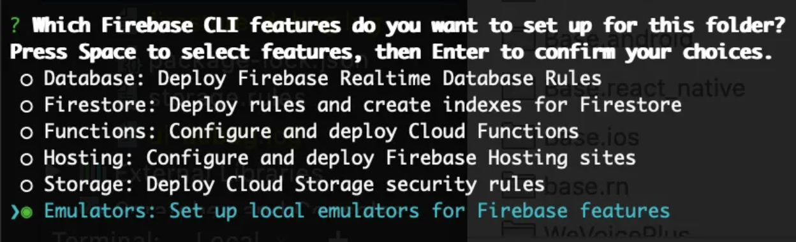
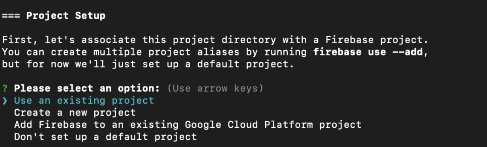
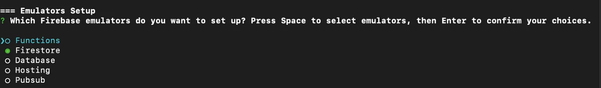

# KickBack - CSE115A - Software Engineering Group Project

_Making plans from the group chat to reality!_

## What is KickBack?

KickBack helps to keep track of plans with friends, making the process simple to use and organized. We do this by having an app that stores planned events and lays out clear processes for a user to make an event plan, have members vote, and remind users of such events. This makes the decision-making process less tedious for the host and group, increasing the chance for plans to actually take place.

## Tech Stack

- React Native
- Expo
- Firebase
- TypeScript
- React Native Testing Library
- Jest

## Other Tools

- Figma
- Discord

## Getting Started

1. To run the app, you will need Node.js installed.
   - If you have Node.js installed, you can check the version by running `node -v` in your terminal.
   - If you do not have Node.js installed, you can download it [here](https://nodejs.org/en/download/).
2. Clone the repository by running `git clone` in your terminal.
3. Install the dependencies by running `npm install` in the root directory.
4. To run the the development server, run `npm start` in the root directory.
   - To run the app on an emulator, you must have either [Android Studio](https://developer.android.com/studio) or [Xcode](https://developer.apple.com/xcode/) installed on your computer. Press `a` in the terminal to run the app on an Android emulator or press `i` in the terminal to run the app on an iOS emulator.
   - Alternatively, you can run the app on your phone by downloading the [Expo Go](https://expo.dev/client) app and scanning the QR code in the terminal.
5. Alternatively, you can run `npm run ios` to run the app on an iOS emulator or `npm run android` to run the app on an Android emulator.
6. To run the tests, run `npm test` in the root directory.
  
## Firebase Emulator
[Official Documentation setup](https://firebase.google.com/docs/cli)
There are two types of databases: local and production. Ideally, we want to keep everything locally, especially during development. The production database will only be used for presentation to TA or amongst each other. 

Note that the production database may have to be wiped if there are any entity changes on our backend repo.

### Prerequisites - Setup
1. Install firebase tools globally: `npm install -g firebase-tools`
2. Log into Firebase CLI using the same credentials as the same account with KickBack firebase access. `firebase login`
3. Initialize the firebase project: `firebase init`
4. During this process, it will ask you a series of question, follow the process as the images  Select the “emulators”, “firestore”, and “storage” option.
5. For project setup, click on an “Existing Project” and select “KickBack”. 
6. For emulators, select Firestore. 

**Note** that there will be opportunities to install other components for the emulator in the future, if needed.

Also, in the case that it asks for overwrite, go ahead and deny those options. The reason for it is because there are files that already exist in the git repository.

### Running the Emulator
Run the command: 
`firebase emulators:start`
Which will bring up a table with URLs. Click on any of them to see the Firebase dashboard.

#### Connecting Emulator on Repo
It’s important to note that whenever you want to use the emulator on the project, make sure that the last two lines in firebaseConfig.ts are uncommented!

Failure to do so will result in connection between production and repo.

## Team Members

- José Chavez
- Cody Lambert
- Ricardo Esquivel
- Jessica Huang
- Samuel Trujillo
